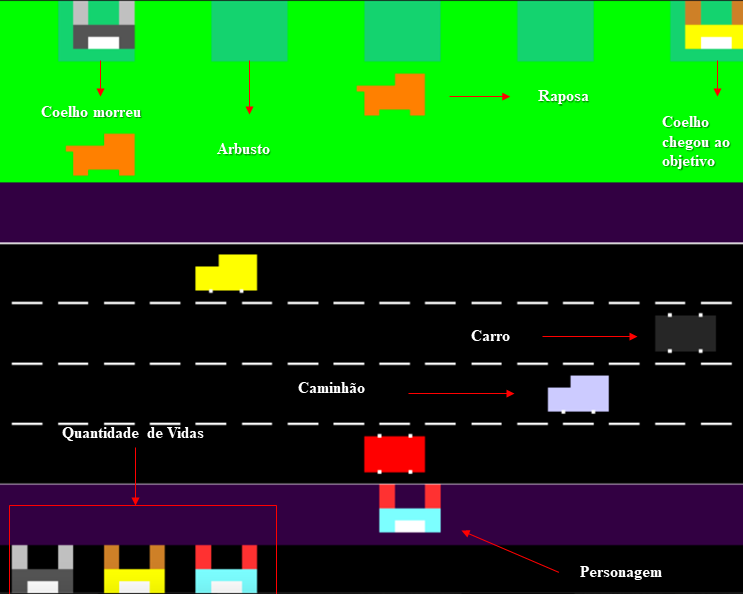
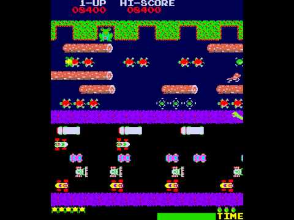

# Rabbits-Life

## Como Jogar

   Quando o jogador começar a controlar o coelho, irá poder se movimentar para cima, baixo e para os lados com as setas do teclado, devendo conseguir chegar aos arbustos no topo do cenário sem colidir com os obstáculos que têm na avenida e floresta. Ele pode também alterar a velocidade dos objetos na cena clicando nas teclas do 1 ao 8.

   Caso ele colide com algum objeto da cena vai perder uma vida, caso ocorra isso tres vezes ele perde o jogo, se ele conseguir atravessar a avenida e a floresta sem encostar nos obstáculos, pelo menos duas vezes ele ganha o jogo.

## Modelagem

## Referência

- Frogger 1981

